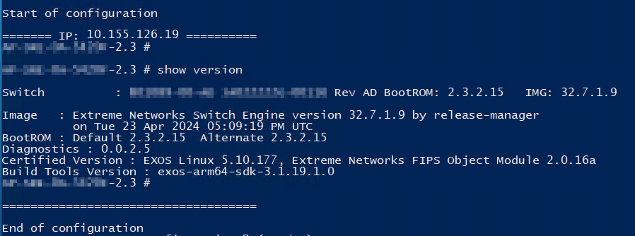

# Objectif

**Ce script a pour but d'envoyer des commandes sur un ensemble d'équipement réseau.<br>
Il inclut un système de log et de validation permettant de choisir de sauvegarder ou non à la fin.<br><br>
Ce dépot contient toutes les dépendances et contient une version portable de python windows.<br>
Pour linux, il faut télécharger une version portable avant d'exécuter le script.**

# Exécution du script & installation

Avant d'exécuter le script, il faut modifier le fichier de configuration et mettre les bonnes commandes. (voir rubrique)

## Windows

Exécuter directement le script dans powershell
```powershell
windows/python.exe script_conf_ssh.py
```

## Linux

Créer le répertoire linux, se déplacer dedans et télécharger miniconda à l'intérieur
```
mkdir linux && cd linux/ && wget https://repo.anaconda.com/miniconda/Miniconda3-latest-Linux-x86_64.sh -O ./miniconda.sh
```

Installer miniconda dans le répertoire courant
```
bash miniconda.sh -b -p ./miniconda
```

Activer le venv miniconda
```
source miniconda/bin/activate
```

Exécuter le script
```
cd .. && python script_conf_ssh.py
```

# Déroulement du script

## Liste des équipements à configurer

Lorsqu'on exécute le script on a le choix entre le mode discovery et le mode classique
```
PATH\script_conf_ssh> .\windows\python.exe .\script_conf_ssh.py
Discovery mode ? yes/no :
```

### Discovery mode

Le discovery mode consiste à fournir un réseau au format NET/CIDR ex: 192.168.3.0/24
Il va ensuite ping les IP de ce réseau et les afficher.
On peut ensuite exclure certaines IP

### Classic mode

Dans ce mode on fournit les IP et les FQDN séparé par une virgule
ex: 10.10.12.3,switch.dom.local,192.168.16.2,172.24.12.6...

## Type d'équipements

Il s'agit de l'os de l'équipement.
```
Device_type :
```

<span style="color:red">Attention il faut mettre une valeur précise (voir ci-dessous)</span>

Si on veut utiliser du telnet, il faut utiliser une valeur spécifique (voir liste complète) 
et utiliser le port 23 (voir section port TCP)

<details>
<summary>Liste des valeurs récurente</summary>

- cisco_ios
- extreme_exos
- extreme_vsp

<br>Liste encore incomplète
</details>

<br>

<details>
<summary>Liste complète</summary>
<br><a href="https://github.com/ktbyers/netmiko/blob/develop/PLATFORMS.md#supported-ssh-device_type-values">Lien officiel</a><br>

###### Supported SSH device_type values

- a10
- accedian
- adtran_os
- adva_fsp150f2
- adva_fsp150f3
- alcatel_aos
- alcatel_sros
- allied_telesis_awplus
- apresia_aeos
- arista_eos
- arris_cer
- aruba_os
- aruba_osswitch
- aruba_procurve
- audiocode_66
- audiocode_72
- audiocode_shell
- avaya_ers
- avaya_vsp
- broadcom_icos
- brocade_fastiron
- brocade_fos
- brocade_netiron
- brocade_nos
- brocade_vdx
- brocade_vyos
- calix_b6
- casa_cmts
- cdot_cros
- centec_os
- checkpoint_gaia
- ciena_saos
- cisco_asa
- cisco_ftd
- cisco_ios
- cisco_nxos
- cisco_s200
- cisco_s300
- cisco_tp
- cisco_viptela
- cisco_wlc
- cisco_xe
- cisco_xr
- cloudgenix_ion
- coriant
- dell_dnos9
- dell_force10
- dell_isilon
- dell_os10
- dell_os6
- dell_os9
- dell_powerconnect
- dell_sonic
- dlink_ds
- digi_transport
- eltex
- eltex_esr
- endace
- enterasys
- ericsson_ipos
- ericsson_mltn63
- ericsson_mltn66
- extreme
- extreme_ers
- extreme_exos
- extreme_netiron
- extreme_nos
- extreme_slx
- extreme_tierra
- extreme_vdx
- extreme_vsp
- extreme_wing
- f5_linux
- f5_ltm
- f5_tmsh
- flexvnf
- fortinet
- generic
- generic_termserver
- hillstone_stoneos
- hp_comware
- hp_procurve
- huawei
- huawei_olt
- huawei_smartax
- huawei_vrp
- huawei_vrpv8
- ipinfusion_ocnos
- juniper
- juniper_junos
- juniper_screenos
- keymile
- keymile_nos
- linux
- mellanox
- mellanox_mlnxos
- mikrotik_routeros
- mikrotik_switchos
- mrv_lx
- mrv_optiswitch
- netapp_cdot
- netgear_prosafe
- netscaler
- nokia_srl
- nokia_sros
- oneaccess_oneos
- ovs_linux
- paloalto_panos
- pluribus
- quanta_mesh
- rad_etx
- raisecom_roap
- ruckus_fastiron
- ruijie_os
- sixwind_os
- sophos_sfos
- supermicro_smis
- teldat_cit
- tplink_jetstream
- ubiquiti_edge
- ubiquiti_edgerouter
- ubiquiti_edgeswitch
- ubiquiti_unifiswitch
- vyatta_vyos
- vyos
- watchguard_fireware
- yamaha
- zte_zxros
- zyxel_os
 
###### Supported Telnet device_type values

- adtran_os_telnet
- apresia_aeos_telnet
- arista_eos_telnet
- aruba_procurve_telnet
- audiocode_72_telnet
- audiocode_66_telnet
- audiocode_shell_telnet
- brocade_fastiron_telnet
- brocade_netiron_telnet
- calix_b6_telnet
- centec_os_telnet
- ciena_saos_telnet
- cisco_ios_telnet
- cisco_xr_telnet
- cisco_s200_telnet
- cisco_s300_telnet
- dell_dnos6_telnet
- dell_powerconnect_telnet
- dlink_ds_telnet
- extreme_telnet
- extreme_exos_telnet
- extreme_netiron_telnet
- generic_telnet
- generic_termserver_telnet
- hp_procurve_telnet
- hp_comware_telnet
- huawei_telnet
- huawei_olt_telnet
- ipinfusion_ocnos_telnet
- juniper_junos_telnet
- nokia_sros_telnet
- oneaccess_oneos_telnet
- paloalto_panos_telnet
- rad_etx_telnet
- raisecom_telnet
- ruckus_fastiron_telnet
- ruijie_os_telnet
- supermicro_smis_telnet
- teldat_cit_telnet
- tplink_jetstream_telnet
- yamaha_telnet
- zte_zxros_telnet
</details>

## Port utilisé

Port 22 par défaut, il suffit d'appuyer sur entrée
Sinon il faut préciser le port

## Credentials

Il faut ensuite entrer les logins.<br>
<span style="color:red">L'ensemble des équipements doit être accessible avec le même compte</span>

## Fichier de configuration

Par défaut, le fichier de configuration est "command.txt".

Avant d'exécuter le script il faut modifier ce fichier en mettant **une commande par ligne**.<br><br>

<span style="color:red">Attention: par défaut le script ce met en mode configuration</span><br>
<span style="margin-left:1%">Par exemple :<br></span>
<span style="margin-left:2%">Sur cisco, si on veut faire un show running-config, vu qu'on est en mode "conf t" 
on doit écrire "do show run..."</span>

## Connexion SSH
Ensuite, le script s'exécute.

Il va afficher les commandes avec leur résultat pour chaque équipement.



## Sauvegarde

Une fois le script exécuté, le script va maintenir les connexions SSH.<br>
Il va nous demander de choisir de sauvegarder ou non.


Cela permet d'aller vérifier à la main que le script a correctement fait sont travail.
On peut aussi redémarrer les switchs si on s'est coupé la main vu qu'on a pas sauvegardé.

# Logs

A chaque exécution du script, on peut retrouver les journaux de sessions dans le dossier `logs/`.<br>
Il est créé automatiquement à la première exécution.

# Troubleshoot

A compléter